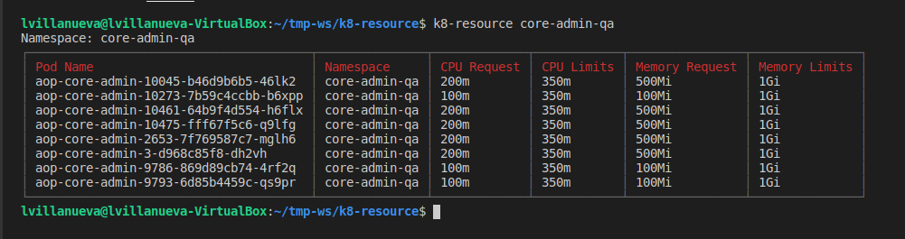

# k8-resource

**Displays CPU and memory (request and limits) in Table Form**
* * *

Requirements:
**Install Node via NVM**
**Logged in via Osprey and in a current kube-context**

1. Go to the root directory then run `npm install -g ./`
2. Create an alias in `.bashrc` or `.bash_aliases` just replace the directory of the project
```alias k8-resource='/home/lvillanueva/sre-ws/k8-resource/run.sh'```
3. Then test command `k8-resource redis-qa`
	* **you need to specify a namespace**

**Sample**

